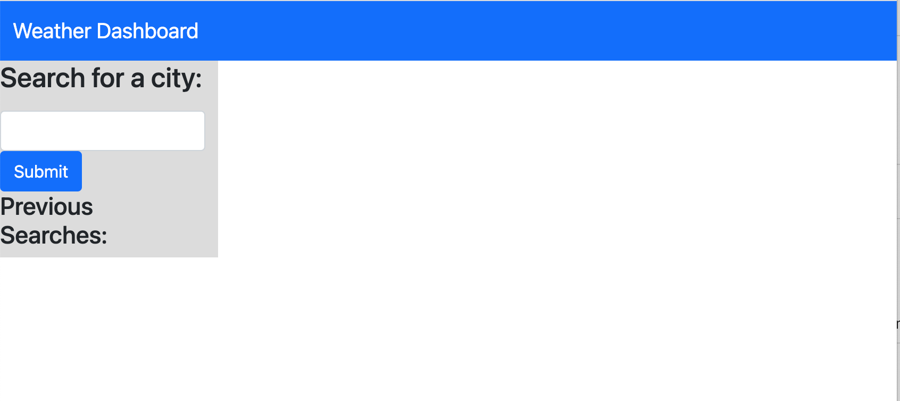
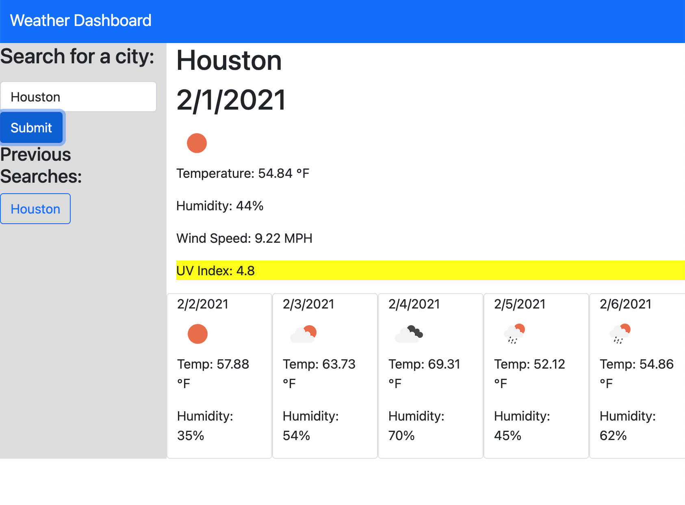
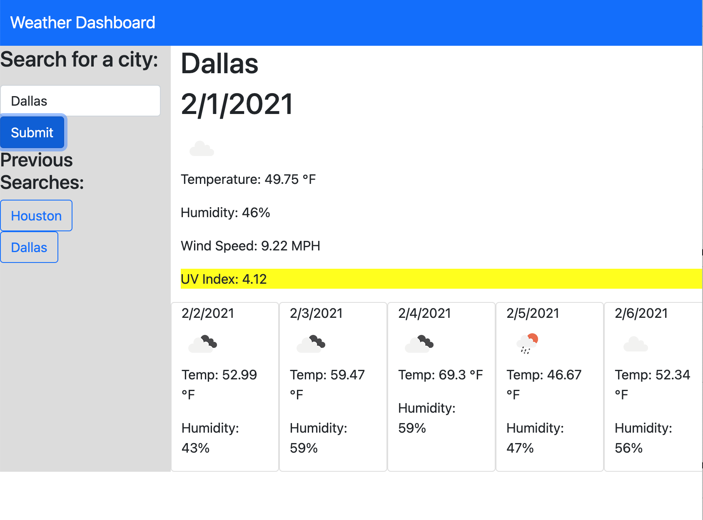

# Weather-Dashboard
Server-Side APIs: Weather Dashboard

## Description

Using no starter code, a third-party API [OpenWeather API](https://openweathermap.org/api) was used to retrive weather information so that when a user inputs a city, the website would provide current and future weather conditions for that city. This included:

* the current weather condition would display name, date, weather icon, temperature, humidity, wind speed, and UV Index,
* a colored UV index to indicate the current condition,
* the 5-day future weather conditions for the inputted city that included date, weather icon, temperature, and humidity, 
* the city would be appended as a previous searched city on the page and saved in localStorage,
* the last searched city forecast when the page is refreshed.

By retriving data from the OpenWeather API, I was able to display the data needed.

## Table of Contents

* [Installation](#installation)
* [Usage](#usage)
* [Credits](#credits)

## Installation

To install, pull repository and open html file in browser. Repository can be found here: [Weather Dashboard Repo](https://github.com/JackieHodges/Weather-Dashboard)

Otherwise, the github page can be found here: [Weather Dashboard Webpage](https://jackiehodges.github.io/Weather-Dashboard/)

## Usage

Below are screenshots of the page:

## Credits

I used the OpenWeather API to fetch current and future weather data. It can be found here: [OpenWeather API](https://openweathermap.org/api). I also used the documentation to ensure the proper weather icons were displayed.

OpenWeather API returned the day/time in a UNIX timestamp. I used resources located at [Coder Rocket Fuel](https://coderrocketfuel.com/article/convert-a-unix-timestamp-to-a-date-in-vanilla-javascript) and [MDN](https://developer.mozilla.org/en-US/docs/Web/JavaScript/Reference/Global_Objects/Date) to ensure the date was formated as requested.

